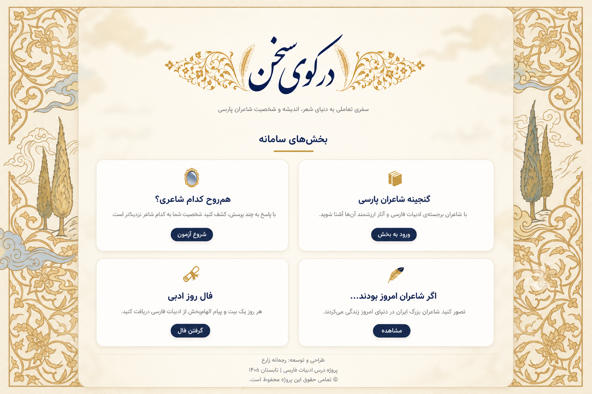

# 📜 Dar Kooye Sokhan

## A Digital Journey Through Persian Poetry, Literature, and Literary Personalities

<p align="center">
  
  
  
  
  
</p>

---

# 🖼️ Project Preview

<p align="center">
  
</p>

---

# ✨ Overview

**Dar Kooye Sokhan (در کوی سخن)** is an interactive Persian literature platform designed to introduce users to the world of Persian poetry, literary history, and the personalities behind the greatest poets of Iran.

Inspired by the elegance of **Persian miniature art** and traditional Iranian aesthetics, this project combines cultural heritage with modern web technologies to create an engaging digital experience.

The main goal of this project is to transform Persian literature from a collection of historical texts into an interactive journey where users can explore poets, discover their personalities, and build a deeper connection with Persian culture and literature.

---

#### 🌐 Live Demo

You can view the live version of the project here:

🔗 https://parvazdevrz.github.io/Dar-Kooye-Sokhan/

---

# 🌿 Main Features

## 📚 Persian Poets Gallery

A structured digital archive dedicated to introducing both **Classical Persian Poets** and **Contemporary Persian Poets**.

The gallery contains two main sections:

---

## 🏛️ Classical Persian Poets

A database containing information about **12 classical Persian poets**, including:

- Biography and historical background
- Literary style and characteristics
- Famous works and masterpieces
- Cultural and philosophical perspectives
- Contributions to Persian literature

This section introduces the timeless figures who shaped Persian poetry and culture.

---

## ✨ Contemporary Persian Poets

A dedicated database introducing **12 contemporary Persian poets**, including:

- Personal background
- Literary activities
- Major works
- Artistic identity
- Influence on modern Persian poetry

This section represents the evolution of Persian literature from classical traditions to modern expressions.

---

# 🧠 Which Poet Is Your Soulmate?

## An Interactive Literary Personality Experience

The main interactive feature of the website.

Users answer a series of personality-based questions, and the system analyzes their responses to determine which Persian poet is closest to their personality, mindset, and emotional characteristics.

This experience creates a unique connection between users and poets by combining personality analysis with literary knowledge.

---

# ✨ If Poets Lived Today...

A creative and imaginative section that explores how Persian poets might exist in today's world.

This section includes a database that presents:

- Possible modern professions of poets
- Their lifestyle in the contemporary era
- Personality characteristics
- A modern interpretation of their biography

The purpose of this feature is to connect historical literary figures with modern society in a creative way.

---

# 📖 Daily Literary Fortune

An interactive poetry-based feature inspired by traditional Persian fortune culture.

This section uses a database of selected poems from classical Persian poets and provides users with:

- A randomly selected poem
- The original verse
- A modern interpretation
- A meaningful explanation of the poem's concept

Every interaction creates a new literary experience for the user.

---

# 🎨 Design Philosophy

The user interface is inspired by:

- Persian miniature art
- Traditional Iranian aesthetics
- Minimal and elegant layouts
- Classical literary atmosphere

## 🎨 Color Palette

| Color | Purpose |
|---|---|
| `#C5A059` | Heritage, elegance, and artistic identity |
| Cream tones | Warmth and readability |
| `#1B2A4A` | Knowledge, depth, and classical atmosphere |

---

# 🛠️ Technologies Used

| Technology | Purpose |
|---|---|
| HTML5 | Semantic structure and page development |
| CSS3 | Styling, layouts, animations, and responsive design |
| Vanilla JavaScript | Interactive features and application logic |
| Vazirmatn Font | Optimized Persian typography |

---

# 📱 Responsive Design

The website is fully responsive and optimized for:

- 💻 Desktop
- 📱 Mobile devices
- 📟 Tablets

Providing a smooth and consistent experience across different screen sizes.

---

# 🚀 Installation & Usage

This project is a static website and does not require any backend server or database.

## Clone the repository:

```bash
git clone https://github.com/ParvazDevRZ/Dar-Kooye-Sokhan.git
```

## Navigate to the project directory:

```bash
cd Dar-Kooye-Sokhan
```

## Run the project:

Open:

```
index.html
```

in your browser.

For development, using **Live Server extension in VS Code** is recommended.

---

# 📂 Project Structure

```text
Dar-Kooye-Sokhan
│
├── index.html
├── style.css
├── script.js
│
├── pages/
│   ├── poets/
│   │   ├── classical/
│   │   └── contemporary/
│   │
│   ├── personality-test/
│   └── fortune/
│
└── images/
    └── screenshot.png
```

---

# 🎯 Project Vision

Persian literature is not only a collection of poems; it is a reflection of human emotions, wisdom, philosophy, and cultural identity.

**Dar Kooye Sokhan** aims to create a bridge between Persian literary heritage and modern technology by providing a digital environment where users can discover poets, explore their ideas, and experience literature in an interactive way.

---

# 👩‍💻 Developer

## ✦ Reyhaneh Zare

**Computer Engineering Student**

Interested in:

- Web Development
- Artificial Intelligence
- Creative Technology Projects
- Building meaningful digital experiences

---

# 📜 License

This project is currently developed for educational and portfolio purposes.

---

<p align="center">

Developed by **Reyhaneh Zare** ✦  
For Persian Literature & Digital Creativity

</p>
